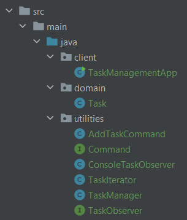
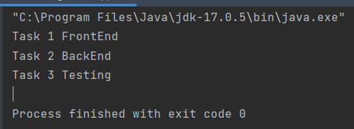

# Task Management System - Readme

## Author

Author: Bunescu Marius TI-203

## Introduction

This project is a simple task management system implemented in Java. The purpose of this system is to manage tasks and provide various functionalities such as adding tasks, displaying tasks, and observing task updates. The project utilizes four behavioral design patterns: Observer, Command, Strategy, and Iterator.

## Implementation & Explanation

### Observer Design Pattern

Location: utilities/TaskManager.java, utilities/TaskObserver.java, utilities/ConsoleTaskObserver.java

In the utilities package, the Observer design pattern is used to handle task updates. The TaskManager class acts as the subject and maintains a list of tasks and a list of observers. When a new task is added, the addTask() method is called, which notifies all the registered observers. The TaskObserver interface defines the update() method, which is implemented by the ConsoleTaskObserver class to display the updated list of tasks on the console.

    // TaskManager.java
    public class TaskManager {
    // ...
    
        public void addTask(Task task) {
            tasks.add(task);
            notifyObservers();
        }
    
        // ...
    
        private void notifyObservers() {
            for (TaskObserver observer : observers) {
                observer.update(tasks);
            }
        }
    
        // ...
    }
    
    // TaskObserver.java
    public interface TaskObserver {
        void update(List<Task> tasks);
    }
    
    // ConsoleTaskObserver.java
    public class ConsoleTaskObserver implements TaskObserver {
        @Override
        public void update(List<Task> tasks) {
            System.out.println("Tasks have been updated:");
            for (Task task : tasks) {
                System.out.println(task.getName());
            }
            System.out.println();
        }
    }

The Observer pattern allows for loose coupling between the TaskManager and the observers, enabling multiple observers to be added or removed dynamically.

### Command Design Pattern

Location: utilities/Command.java, utilities/AddTaskCommand.java

The Command design pattern is used to encapsulate the request of adding a task into an object. The Command interface defines the execute() method, which is implemented by the AddTaskCommand class. The AddTaskCommand class takes a TaskManager instance and a Task object as parameters and executes the addTask() method on the TaskManager object when the execute() method is called.

    // Command.java
    public interface Command {
    void execute();
    }
    
    // AddTaskCommand.java
    public class AddTaskCommand implements Command {
    private TaskManager taskManager;
    private Task task;
    
        public AddTaskCommand(TaskManager taskManager, Task task) {
            this.taskManager = taskManager;
            this.task = task;
        }
    
        @Override
        public void execute() {
            taskManager.addTask(task);
        }
    }

The Command pattern allows for decoupling the requester (TaskManagementApp) from the executor (TaskManager) by encapsulating a request as an object. It provides flexibility and extensibility by allowing new commands to be added easily.

### Strategy Design Pattern

Location: utilities/TaskObserver.java, utilities/ConsoleTaskObserver.java

The Strategy design pattern is used to define different strategies for observing tasks. The TaskObserver interface declares the update() method, which is implemented by the ConsoleTaskObserver class. The ConsoleTaskObserver class defines a specific strategy for displaying tasks on the console.

    // TaskObserver.java
    public interface TaskObserver {
        void update(List<Task> tasks);
    }
    
    // ConsoleTaskObserver.java
    public class ConsoleTaskObserver implements TaskObserver {
        @Override
        public void update(List<Task> tasks) {
            System.out.println("Tasks have been updated:");
            for (Task task : tasks) {
                System.out.println(task.getName());
            }
            System.out.println();
        }
    }
The Strategy pattern allows the system to choose different strategies (observers) at runtime. It enables flexibility in selecting and using different algorithms or behaviors without tightly coupling them to the main logic.

### Iterator Design Pattern

Location: utilities/TaskIterator.java

The Iterator design pattern is used to iterate over the collection of tasks. The TaskIterator class implements the Iterator interface and provides methods to iterate over the list of tasks.

    // TaskIterator.java
    public class TaskIterator implements Iterator<Task> {
    private List<Task> tasks;
    private int currentIndex = 0;

    public TaskIterator(List<Task> tasks) {
        this.tasks = tasks;
    }

    @Override
    public boolean hasNext() {
        return currentIndex < tasks.size();
    }

    @Override
    public Task next() {
            if (hasNext()) {
                Task task = tasks.get(currentIndex);
                currentIndex++;
                return task;
            }
        return null;
        }
    }

The Iterator pattern provides a way to access the elements of a collection sequentially without exposing its underlying representation. It simplifies the iteration process and allows for uniform traversal over different types of collections.

## Results/Conclusions

The implementation of the behavioral design patterns in this task management system brings several benefits:

* The Observer pattern enables the dynamic update of tasks and provides a flexible way to add or remove observers.
* The Command pattern encapsulates the request to add a task, allowing for easy extensibility with new commands.
* The Strategy pattern allows different strategies for observing tasks, facilitating flexibility and runtime selection.
* The Iterator pattern simplifies the iteration process and provides a consistent way to access the tasks in the collection.
By utilizing these design patterns, the task management system becomes more modular, maintainable, and extensible. The patterns help in separating concerns, promoting code reusability, and improving overall system design.

In conclusion, the usage of the Observer, Command, Strategy, and Iterator design patterns enhances the task management system by improving its flexibility, modularity, and maintainability. These patterns provide a solid foundation for handling task updates, encapsulating commands, defining strategies, and iterating over tasks.
